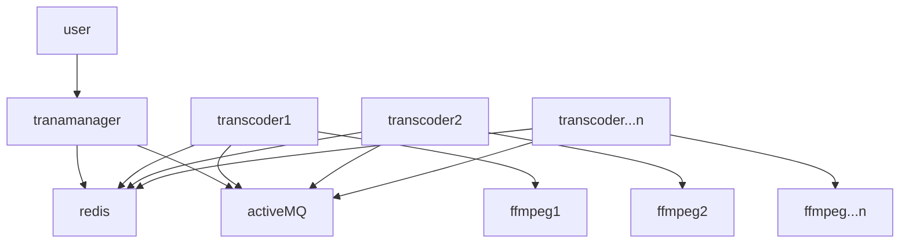

# transcoderG(client) transmanagerB(manager)

# FFMPEG 활용 MTS develop

>  #목차
>  1. 개발환경
>  2. ffmpeg
>  3. HAProxy
>  4. activeMQ
>  5. Redis
>  6. 추후 할 수 있는일

# 1. 개발환경
- jdk : java 1.7
- 프레임워크 : spring boot 1.4.1.RELEASE
- gradle build 옵션 : -x test clean build
- transmanagerB dependencies (war 배포)
      dependencies {
          compile('org.springframework.boot:spring-boot-starter-web')
          compile('org.springframework.boot:spring-boot-starter-thymeleaf')
          compile('org.springframework.boot:spring-boot-starter-activemq')
          compile('org.springframework.boot:spring-boot-starter-redis')
          compile group: 'org.aspectj', name: 'aspectjweaver', version: '1.8.9'
          compile group: 'org.projectlombok', name: 'lombok', version: '1.16.10'
          compile group: 'org.slf4j', name: 'slf4j-api', version: '1.7.21'
          compile group: 'ch.qos.logback', name: 'logback-classic', version: '1.1.7'
          compile group: 'org.lazyluke', name: 'log4jdbc-remix', version: '0.2.7'
          compile group: 'org.apache.commons', name: 'commons-lang3', version: '3.4'
          compile group: 'com.google.guava', name: 'guava', version: '19.0'
          compile group: 'com.google.code.gson', name: 'gson', version: '2.7'
          compile group: 'org.apache.commons', name: 'commons-pool2', version: '2.4.2'
          compile group: 'io.springfox', name: 'springfox-swagger2', version: '2.6.0'
          compile group: 'io.springfox', name: 'springfox-swagger-ui', version: '2.6.0'
          testCompile('org.springframework.boot:spring-boot-starter-test')
      }
- transcoderG dependencies (jar 배포)
        dependencies {
            compile('org.springframework.boot:spring-boot-starter')
            compile('org.springframework.boot:spring-boot-starter-validation')
            compile('org.springframework.boot:spring-boot-starter-activemq')
            compile('org.springframework.boot:spring-boot-starter-redis')
            compile group: 'org.projectlombok', name: 'lombok', version: '1.16.10'
            compile group: 'org.slf4j', name: 'slf4j-api', version: '1.7.21'
            compile group: 'ch.qos.logback', name: 'logback-classic', version: '1.1.7'
            compile group: 'com.fasterxml.jackson.core', name: 'jackson-databind', version: '2.8.3'
            compile group: 'com.google.guava', name: 'guava', version: '19.0'
            compile group: 'com.google.code.gson', name: 'gson', version: '2.7'
            compile group: 'io.netty', name: 'netty-all', version: '4.1.5.Final'
            testCompile('org.springframework.boot:spring-boot-starter-test')
        }

# 2. ffmpeg
1. 의존 관계(dependency)가 있는 library 다운로드 및 업데이트 (root)
		$> yum install autoconf automake cmake freetype-devel gcc gcc-c++ git libtool make mercurial nasm pkgconfig zlib-devel

2. ffmpeg_sources 폴더 생성
		ffmpeg과 관련된 소스를 다운로드 받을 폴더를 생성한다.
		$> mkdir /home/tvingadmin/ffmpeg_sources

3. Yasm 설치
        $> git clone --depth 1 git://github.com/yasm/yasm.git
        $> cd yasm
        $> autoreconf -fiv
        $> ./configure --prefix="$HOME/ffmpeg_build" --bindir="$HOME/bin"
        $> make && make install && make distclean

4. libx264 설치
        H.264 비디오 인코더를 설치한다.
        $> git clone --depth 1 git://git.videolan.org/x264
        $> cd x264
        $> ./configure --prefix="$HOME/ffmpeg_build" --bindir="$HOME/bin" --enable-static
        $> make && make install && make distclean

4. libx265 설치
        H.265/HEVC 비디오 인코더를 설치한다.
        $> hg clone https://bitbucket.org/multicoreware/x265
        $> cd ~/ffmpeg_sources/x265/build/linux <- 디렉토리 이동 /home/tvingadmin/ffmpeg_sources/x265/build/linux
        $> cmake -G "Unix Makefiles" -DCMAKE_INSTALL_PREFIX="$HOME/ffmpeg_build" -DENABLE_SHARED:bool=off ../../source
        $> make && make install

5. libfdk-aac 설치
        AAC 오디오 인코더를 설치한다.
        $> git clone --depth 1 git://git.code.sf.net/p/opencore-amr/fdk-aac
        $> cd fdk-aac
        $> autoreconf -fiv
        $> ./configure --prefix="$HOME/ffmpeg_build" --disable-shared
        $> make && make install && make distclean

6. libmp3lame 설치
        MP3 오디오 인코더를 설치한다. 
        $> curl -L -O http://downloads.sourceforge.net/project/lame/lame/3.99/lame-3.99.5.tar.gz
        $> tar -xvzf lame-3.99.5.tar.gz
        $> cd lame-3.99.5
        $> ./configure --prefix="$HOME/ffmpeg_build" --bindir="$HOME/bin" --disable-shared --enable-nasm
        $> make && make install && make distclean

7. libogg 설치
        Ogg bitstream 라이브러리를 설치한다.
        $> curl -O http://downloads.xiph.org/releases/ogg/libogg-1.3.2.tar.gz
        $> tar -xvzf libogg-1.3.2.tar.gz
        $> cd libogg-1.3.2
        $> ./configure --prefix="$HOME/ffmpeg_build" --disable-shared
        $> make && make install && make distclean

8. libvorbis 설치
        Vorbis 오디오 인코더를 설치한다. 설치시 libogg가 필요하다. 
        $> curl -O http://downloads.xiph.org/releases/vorbis/libvorbis-1.3.4.tar.gz
        $> tar -xvzf libvorbis-1.3.4.tar.gz
        $> cd libvorbis-1.3.4
        $> LDFLAGS="-L$HOME/ffmeg_build/lib" CPPFLAGS="-I$HOME/ffmpeg_build/include" ./configure --prefix="$HOME/ffmpeg_build" --with-ogg="$HOME/ffmpeg_build" --disable-shared
        $> make && make install && make distclean

8. libvpx 설치 (설치 안됨)
        VP8/VP9 비디오 인코더를 설치한다.
        $> git clone --depth 1 https://chromium.googlesource.com/webm/libvpx.git
        $> cd libvpx
        $> ./configure --prefix="$HOME/ffmpeg_build" --disable-examples
        $> make && make install && make distclean

9. ffmpeg 설치
        $> git clone --depth 1 git://source.ffmpeg.org/ffmpeg
        $> cd ffmpeg
        $> PKG_CONFIG_PATH="$HOME/ffmpeg_build/lib/pkgconfig" ./configure --prefix="$HOME/ffmpeg_build" --extra-cflags="-I$HOME/ffmpeg_build/include" --extra-ldflags="-L$HOME/ffmpeg_build/lib" --bindir="$HOME/bin" --pkg-config-flags="--static" --enable-gpl --enable-nonfree --enable-libfdk-aac --enable-libfreetype --enable-libmp3lame --enable-libvorbis --enable-libvpx --enable-libx264 --enable-libx265
        $> make && make install && make distclean
        $> hash -r

        $> PKG_CONFIG_PATH="$HOME/ffmpeg_build/lib/pkgconfig" ./configure --prefix="$HOME/ffmpeg_build" --extra-cflags="-I$HOME/ffmpeg_build/include" --extra-ldflags="-L$HOME/ffmpeg_build/lib" --bindir="$HOME/bin" --pkg-config-flags="--static" --enable-gpl --enable-nonfree --enable-libfdk-aac --enable-libfreetype --enable-libmp3lame --enable-libvorbis --enable-libx264 --enable-libx265

10. ffmpeg Update 시
        업데이트를 위해서는 처음에는 오래된 파일들을 삭제하고, dependency 라이브러리들을 업데이트 한다.
        $> rm -rf ~/ffmpeg_build ~/bin/{ffmpeg, ffprobe, ffserver, lame, vsyasm, x264, x265, yasm, ytasm}
        # update Yasm
        $> cd ~/ffmpeg_sources/yasm
        $> make distclean
        $> git pull
        # pull이 완료되면 Yasm 설치 시 언급한 ./configure, make, make install 진행.

        # update x264
        $> cd ~/ffmpeg_sources/x264
        $> make distclean
        $> git pull
        # pull이 완료되면 x264 설치 시 언급한 ./configure, make, make install 진행.

        # update x265
        $> cd ~/ffmpeg_sources/x265
        $> rm -rf ~/ffmpeg_sources/x265/build/linux/*
        $> hg update
        $> cd ~/ffmpeg_sources/x265/build/linux
        # 이 후, x265 설치 시 언급한 cmake, make, make install 진행.

        # update libfdk_aac
        $> cd ~/ffmpeg_sources/fdk_aac
        $> make distclean
        $> git pull
        # pull이 완료되면 libfdk_aac 설치 시 언급한 ./configure, make, make install 진행.

        #update libvpx
        $> cd ~/ffmpeg_sources/libvpx
        $> make clean
        $> git pull
        # pull이 완료되면 libvpx 설치 시 언급한 ./configure, make, make install을 진행.

        # update FFmpeg
        $> cd ~/ffmpeg_sources/ffmpeg
        $> make distclean
        $> git pull
        # pull이 완료되면 ffmpeg 설치 시 언급한 ./configure, make, make install을 진행.

11. ffmpeg 삭제 시
        $> rm -rf ~/ffmpeg_build ~/ffmpeg_sources ~/bin/{ffmpeg, ffprobe, ffserver, lame, vsyasm, x264, yasm, ytasm}
        $> hash -r

12. ffmpeg 명령어 설정 (application.properties)
        ffmpeg.path=ffmpeg 
        ffmpeg.option=-y -i 
        ffmpeg.preset01=-vcodec libx264 -level:v 3.1 -profile:v baseline -pass:v 1 -coder:v cavlc -r:v 30 -rc:v cbr -s:v 320x180 -b:v 300k -acodec aac -ac 2 -ar 44100 -b:a 64k -threads 0 
        ffmpeg.preset02=-vcodec libx264 -level:v 3.1 -profile:v baseline -pass:v 1 -coder:v cavlc -r:v 30 -rc:v cbr -s:v 640X360 -b:v 600k -acodec aac -ac 2 -ar 44100 -b:a 64k -threads 0 
        ffmpeg.preset03=-vcodec libx264 -level:v 3.1 -profile:v baseline -pass:v 1 -coder:v cavlc -r:v 30 -rc:v cbr -s:v 640X360 -b:v 900k -acodec aac -ac 2 -ar 44100 -b:a 128k -threads 0 
        ffmpeg.preset04=-vcodec libx264 -level:v 3.1 -profile:v baseline -pass:v 1 -coder:v cavlc -r:v 30 -rc:v cbr -s:v 960x540 -b:v 1500k -acodec aac -ac 2 -ar 44100 -b:a 128k -threads 0 
        ffmpeg.preset05=-vcodec libx264 -level:v 3.1 -profile:v baseline -pass:v 1 -coder:v cavlc -r:v 30 -rc:v cbr -s:v 1280x720 -b:v 3000k -acodec aac -ac 2 -ar 44100 -b:a 128k -threads 0 
        ffmpeg.srcpath=/home/tvingadmin/ffmpeg/in/
        ffmpeg.destpath=/home/tvingadmin/ffmpeg/out/

# 3.HAProxy A [Link](http://d2.naver.com/helloworld/284659 "HAProxy")
> 현재 도메인이 없는 관계로 L4/L7 스위치의 대안, 오픈 소스 로드 밸런서 HAProxy.
        1. HAProxy 설치
        라이브 적용시 필요없어서 진행하지 않음.

# 4. activeMQ
1. 설치
        wget http://archive.apache.org/dist/activemq/apache-activemq/5.9.0/apache-activemq-5.9.0-bin.tar.gz
        tar -xvzf apache-activemq-5.9.0-bin.tar.gz
2. 설정 http://activemq.apache.org/how-can-i-support-priority-queues.html
        vi activemq.xml
        <policyEntry queue=">" prioritizedMessages="true" useCache="false" expireMessagesPeriod="0" queuePrefetch="1" />
3. activeMQ 구동
        ./activemq start
        ./activemq stop
4. 모니터링
  		http://[IP]:8161/admin/

# 5. REDIS
1. 설치
       wget http://download.redis.io/releases/redis-3.2.4.tar.gz
       tar xzf redis-3.2.4.tar.gz
       cd redis-3.2.4
       sudo make
       sudo make install
       cd utils
2. 설정
       redis.conf default 설정
3. 구동
       sudo ./install_server.sh
       sudo /etc/init.d/redis_6379 start
       sudo /etc/init.d/redis_6379 stop
       or
       src/redis-server start (사용중)
       src/redis-server stop (사용중)
4. 모니터링 https://redisdesktop.com/
       Redis Desktop Manager

# 6. 추후 할 수 있는일
    transcoder 프로세스가 정상적으로 실행되고 있는지 모니터링할 수 있는 방법필요.(수정개발난이도 중)
    헐리웃 영화에 대해서 5M 파일로 서비스하는 경우가 있음.(수정개발난이도 하)
    해외영화에 대한 자막파일 인코딩 테스트 하지 않음.(수정개발난이도 상)
    시작시간 종료시간 지정하여 클립생성가능할 것으로 보임.(수정개발난이도 상)
    CP사별 업로드 폴더 지정 후 업로드 완료시 자동으로 트랜스코딩되게 개발가능할 것으로 보임.(수정개발난이도 상)
    라이브 적용시 transmanager / redis / activeMQ 이중화 테스트 필요.(수정개발난이도 중)
    redis 의 경우 메모리를 기본으로 서비스 하고 프로세스 재구동 시 디스크에서 데이터 읽어오게 튜닝할 필요성 있음.(수정개발난이도 중)
 
